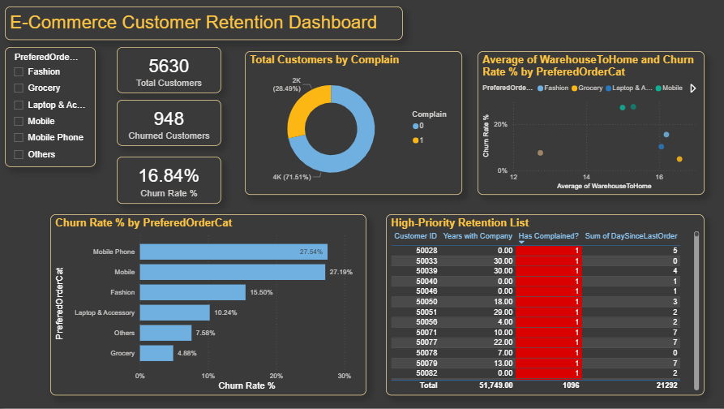

# E-Commerce-Customer-Churn-Analysis
## Project Overview
This project analyzes a dataset of 5,630 e-commerce customers to identify key drivers of churn and provide actionable retention strategies. The goal was to move beyond simple reporting and provide a "High-Priority Retention List" for business intervention.

### **Key Insights & KPIs**
Overall Churn Rate: 16.84%

Total Customers Analyzed: 5,630

Total Churned Customers: 948

Primary Churn Driver: Customers who raised a Complaint showed a significantly higher churn risk compared to those who did not.

Category Risk: The Mobile Phone and Mobile categories experience the highest churn rates at approximately 27%.

Logistics Impact: Analysis identifies a correlation between Warehouse-to-Home distance and customer attrition.

### **Technical Skills Applied**
**1. Data Cleaning & Transformation**
Power Query: Handled missing values for Tenure (replaced with 0) and WarehouseToHome (replaced with the column average).

Data Formatting: Standardized data types for financial values and customer IDs to ensure data integrity.

**2. DAX Measures**
Total Customers: Total Customers = COUNT('E Comm'[CustomerID])

Churned Customers: Churned Customers = SUM('E Comm'[Churn])

Churn Rate %: Churn Rate % = DIVIDE([Churned Customers], [Total Customers], 0)

**3. Data Visualization**
Executive KPIs: High-level summary cards for immediate status updates.

Risk Analysis: Scatter plots to correlate warehouse distance with churn.

Interactive Slicers: Enabled filtering by Product Category for departmental analysis.

Conditional Formatting: Applied red-flag highlighting for customers who have complained to prioritize outreach.

 ## How to Use This Dashboard
Identify At-Risk Customers: Use the High-Priority Retention List to see active customers (Churn = 0) who have active complaints.

Filter by Category: Use the slicer on the left to focus on specific product departments.

Analyze Logistics: View the Scatter Plot to identify if specific warehouse distances are causing delivery friction.

